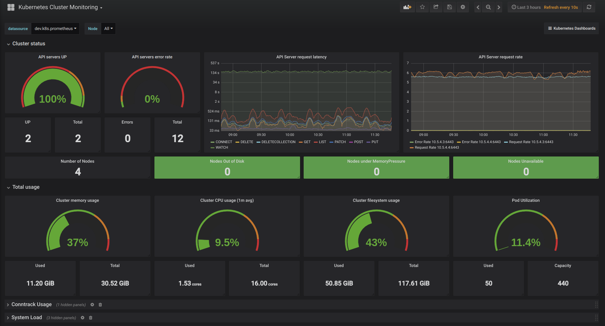
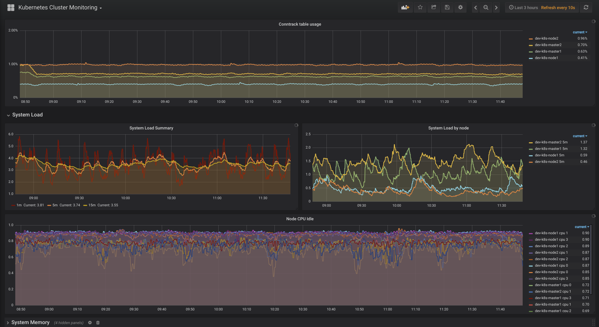
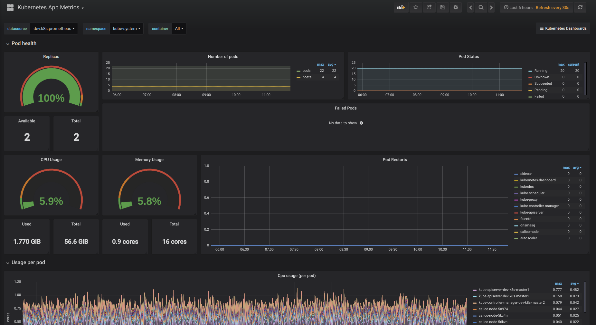
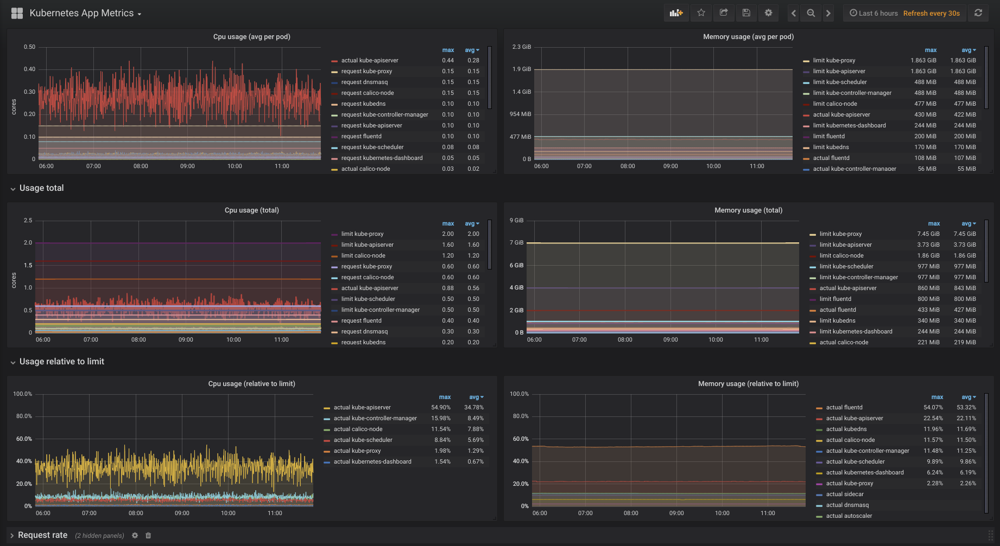

# Intro

This repo contains Kubernetes manifests for deploying the Prometheus into Kubernetes cluster. Alongside with Prometheus also the node-exporter DaemonSet and kube-state-metrics Deployment will be added in order to expand the amount of available metrics.

There is also a set of Grafana dashboards which could make use of all the important metrics. They cover the overall cluster monitoring (divided by nodes), the applications monitoring (divided by namespaces and deployments) and the nginx ingress monitoring. The Grafana deployment itself is not included. So the dashboards could be used either with standalone Grafana or with Kubernetes-based Grafana.

# Prerequisites

## Namespace

The `monitoring` namespace should be created before applying the manifests.

## Running on master

The Prometheus deployment is configured to tolerate the master nodes and is expected to be started only on one of them to keep the data available. The `dedicated` label is used for that. Assign it to one of the nodes:

```sh
kubectl label nodes <node> dedicated=master
```

If you'd like to use emptyDir volume for keeping the data then uncomment the appropriate line in `3.prometheus-deployment.yaml` and comment out the `hostPath` entry. But keep in mind that using emptyDir will lead to losing all the data on any deploymant changes including version upgrade. If you'd like to use hostPath then just prepare the /storage folder:

```sh
sudo mkdir /storage
sudo chmod 777 /storage
```

You could also use any persisted storage.

## VTS mode on Nginx Ingress

In order to scrape the vts metrics from Nginx Ingress (they are referenced in the Grafana dashboard) you should be sure that the vts-status is enabled for the ingress. This can be achieved by editing the nginx-configuration ConfigMap as follows:

```
kind: ConfigMap
apiVersion: v1
metadata:
  name: nginx-configuration
  namespace: ingress-nginx
  labels:
    app: ingress-nginx
data:
  enable-vts-status: "true"
```

## NodePort

Service manifest uses NodePort for exposing the Prometheus on port 30000. You could probably modify `4.prometheus-service.yaml` for your needs to use anything else (like Ingress or LoadBalancer).

# Appying

Just run the kubectl command:

```sh
kubectl create ns monitoring
kubectl apply -f https://raw.githubusercontent.com/agapoff/kubernetes-prometheus/master/deploy/1.cluster-role.yaml
kubectl apply -f https://raw.githubusercontent.com/agapoff/kubernetes-prometheus/master/deploy/2.prometheus-configmap.yaml
kubectl apply -f https://raw.githubusercontent.com/agapoff/kubernetes-prometheus/master/deploy/3.prometheus-deployment.yaml
kubectl apply -f https://raw.githubusercontent.com/agapoff/kubernetes-prometheus/master/deploy/4.prometheus-service.yaml
kubectl apply -f https://raw.githubusercontent.com/agapoff/kubernetes-prometheus/master/deploy/5.node-exporter-ds.yaml
kubectl apply -f https://raw.githubusercontent.com/agapoff/kubernetes-prometheus/master/deploy/6.kube-state-metrics.yaml
```

# Grafana Examples

Just some insights.








